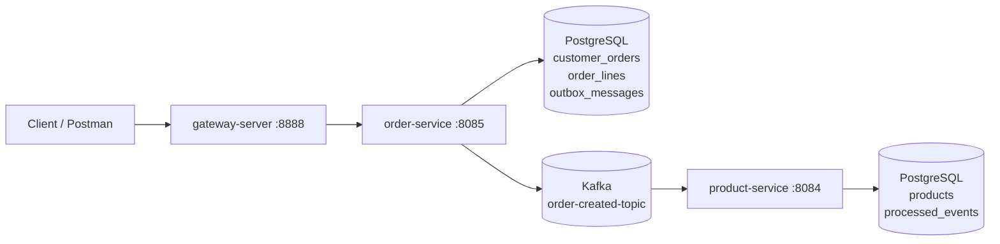
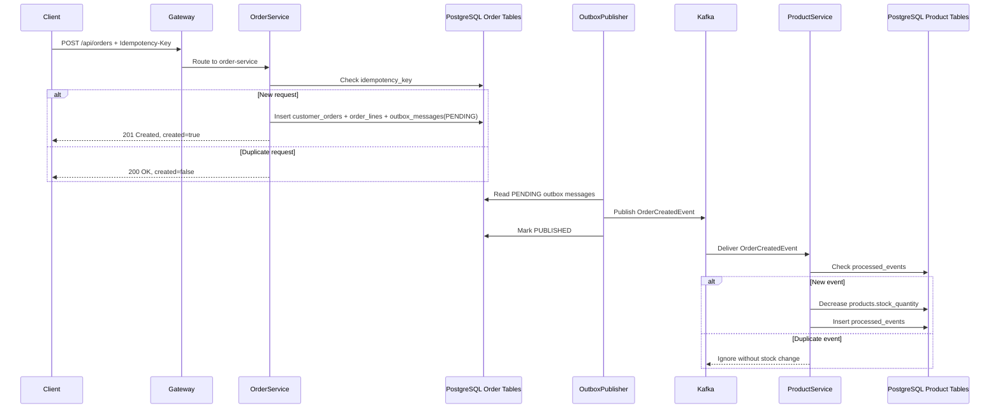

# Order - Product Event Flow Architecture

Bu dokuman, `order-service` ile `product-service` arasinda kurulan gercek siparis akisini, Kafka event iletisimini, idempotency yaklasimini, Transactional Outbox Pattern kullanimini ve PostgreSQL entegrasyonunu aciklar.

## Kapsam

Bu entegrasyonda hedeflenen akis:

1. Client `order-service` uzerinden siparis olusturur.
2. `order-service` siparisi ve outbox mesajini ayni transaction icinde PostgreSQL'e kaydeder.
3. Outbox publisher bekleyen mesaji Kafka'ya `OrderCreatedEvent` olarak yayinlar.
4. `product-service` bu event'i dinler.
5. Event icindeki urunler icin stok dusurulur.
6. Ayni istek veya ayni event tekrar gelirse islem ikinci kez uygulanmaz.

## Yuksek Seviye Mimari



## Runtime Bilesenleri

### PostgreSQL

Local PostgreSQL container:

- Container adi: `order-db`
- Host: `localhost`
- Port: `5432`
- Database: `microservices-spring`
- User: `admin`
- Password: `admin`

Servislerde datasource ayarlari env override destekli verildi:

```yaml
spring:
  datasource:
    url: ${POSTGRES_URL:jdbc:postgresql://localhost:5432/microservices-spring}
    driver-class-name: org.postgresql.Driver
    username: ${POSTGRES_USER:admin}
    password: ${POSTGRES_PASSWORD:admin}
```

Bu sayede local default degerlerle calisir, farkli ortamda ise `POSTGRES_URL`, `POSTGRES_USER`, `POSTGRES_PASSWORD` ile ezilebilir.

### Kafka

Siparis akisi icin kullanilan asil topic:

- Topic: `order-created-topic`
- Producer binding: `orderCreatedEvent-out-0`
- Consumer binding: `processOrderCreatedEvent-in-0`
- Consumer group: `product-service-group`

Projede daha onceki demo haberlesme icin `test-topic` de korunmustur. `test-topic` mevcut test/demo event akisi icindir; gercek siparis ve stok akisi `order-created-topic` uzerinden ilerler.

## Order Service

### Sorumluluk

`order-service` siparisin giris noktasidir. Siparisi olusturur, idempotency kontrolunu yapar ve `OrderCreatedEvent` yayinlanmasi icin outbox kaydi uretir.

### Ilgili Dosyalar

- `microservices/order-service/src/main/java/com/turkcell/order_service/OrdersController.java`
- `microservices/order-service/src/main/java/com/turkcell/order_service/dto/CreateOrderRequest.java`
- `microservices/order-service/src/main/java/com/turkcell/order_service/dto/OrderResponse.java`
- `microservices/order-service/src/main/java/com/turkcell/order_service/service/OrderCommandService.java`
- `microservices/order-service/src/main/java/com/turkcell/order_service/service/OutboxPublisher.java`
- `microservices/order-service/src/main/java/com/turkcell/order_service/entity/CustomerOrder.java`
- `microservices/order-service/src/main/java/com/turkcell/order_service/entity/OrderLine.java`
- `microservices/order-service/src/main/java/com/turkcell/order_service/entity/OutboxMessage.java`
- `microservices/order-service/src/main/java/com/turkcell/order_service/event/OrderCreatedEvent.java`
- `microservices/order-service/src/main/resources/application.yaml`

### Endpoint

```http
POST /api/orders
```

Gateway uzerinden:

```http
POST http://localhost:8888/api/orders
```

Header:

```text
Content-Type: application/json
Idempotency-Key: order-001
```

Body:

```json
{
  "products": [
    {
      "productId": "GET /api/products response icindeki product id",
      "quantity": 2
    },
    {
      "productId": "GET /api/products response icindeki baska bir product id",
      "quantity": 1
    }
  ]
}
```

### Idempotency-Key Neden Kullaniliyor?

Client ayni siparis istegini network problemi, timeout veya kullanici tekrar denemesi nedeniyle birden fazla kez gonderebilir. `Idempotency-Key`, ayni mantiksal istegin tekrarini anlamak icin kullanilir.

Uygulama davranisi:

- Ilk kez gelen `Idempotency-Key` icin yeni siparis olusturulur.
- Ayni key tekrar gelirse yeni siparis olusturulmaz.
- Mevcut siparis response olarak doner.
- Yeni outbox mesaji uretilmez.
- Stok dusme akisi tekrar tetiklenmez.

Bu kontrol `OrderCommandService` icinde `OrderRepository.findByIdempotencyKey(...)` ile yapilir.

PostgreSQL tarafinda `customer_orders.idempotency_key` unique constraint ile korunur.

### Order Tablolari

`customer_orders`

- Siparis ana kaydini tutar.
- `id`: siparis id
- `idempotency_key`: client tarafindan verilen idempotency anahtari
- `status`: su an `CREATED`
- `created_at`: olusturma zamani

`order_lines`

- Siparisteki urun satirlarini tutar.
- `order_id`: `customer_orders` referansi
- `product_id`: siparis edilen urun
- `quantity`: adet

`outbox_messages`

- Kafka'ya yayinlanacak domain event'lerini tutar.
- `id`: event id
- `aggregate_type`: `ORDER`
- `aggregate_id`: order id
- `event_type`: `OrderCreatedEvent`
- `payload`: event JSON payload
- `status`: `PENDING` veya `PUBLISHED`
- `created_at`, `published_at`: takip alanlari

## Transactional Outbox Pattern

Direkt Kafka'ya publish etmek yerine once outbox tablosuna yaziliyor. Bunun nedeni siparis kaydi ile event yayinlama arasinda tutarlilik saglamaktir.

`OrderCommandService.create(...)` tek transaction icinde sunlari yapar:

1. Idempotency kontrolu yapar.
2. `customer_orders` kaydini olusturur.
3. `order_lines` kayitlarini olusturur.
4. `OrderCreatedEvent` payload'unu hazirlar.
5. `outbox_messages` tablosuna `PENDING` status ile yazar.

Bu transaction commit olursa hem siparis hem event niyeti kalici hale gelir. Commit olmazsa ikisi de yazilmaz.

`OutboxPublisher` daha sonra scheduled olarak calisir:

```java
@Scheduled(fixedDelayString = "${app.outbox.publish-delay-ms:2000}")
```

Her calismada `PENDING` outbox mesajlarini okur, Kafka'ya `orderCreatedEvent-out-0` binding'i ile yayinlar ve basarili olursa mesaji `PUBLISHED` yapar.

Kafka gecici olarak ulasilamazsa mesaj `PENDING` kalir ve sonraki scheduled calismada tekrar denenir.

## OrderCreatedEvent

Event kontrati iki serviste de ayni alanlarla tanimlandi:

```java
public record OrderCreatedEvent(
    UUID eventId,
    UUID orderId,
    Instant occurredAt,
    List<OrderItem> products
) {
    public record OrderItem(UUID productId, int quantity) {
    }
}
```

Alanlar:

- `eventId`: event idempotency icin benzersiz event kimligi
- `orderId`: siparis kimligi
- `occurredAt`: event olusma zamani
- `products`: stok dusulecek urunler ve adetleri

## Product Service

### Sorumluluk

`product-service`, `OrderCreatedEvent` event'ini dinler ve event icindeki her urun icin stok dusurur. Ayni event tekrar gelirse stok tekrar dusmez.

### Ilgili Dosyalar

- `microservices/product-service/src/main/java/com/turkcell/product_service/controller/ProductsController.java`
- `microservices/product-service/src/main/java/com/turkcell/product_service/consumer/OrderCreatedEventConsumer.java`
- `microservices/product-service/src/main/java/com/turkcell/product_service/service/ProductStockService.java`
- `microservices/product-service/src/main/java/com/turkcell/product_service/entity/Product.java`
- `microservices/product-service/src/main/java/com/turkcell/product_service/entity/ProcessedEvent.java`
- `microservices/product-service/src/main/java/com/turkcell/product_service/event/OrderCreatedEvent.java`
- `microservices/product-service/src/main/resources/application.yaml`

### Product Tablolari

`products`

- Urun stoklarini tutar.
- Product id servis tarafinda UUID olarak otomatik atanir.
- Client tarafindan product id gonderilirse request reddedilir.
- PostgreSQL'e gecisten once seed edilen test urunleri DB'de kalici olarak durur; yeni bos DB'de urunleri API uzerinden olusturmak gerekir.

`processed_events`

- Islenmis event id'lerini tutar.
- `OrderCreatedEvent` tekrar gelirse event id burada bulundugu icin stok tekrar dusulmez.

### Consumer Idempotency

Kafka en az bir kez teslimat mantigi ile calisir. Bu nedenle ayni event bazi durumlarda tekrar gelebilir.

`ProductStockService.process(...)` su sirayla calisir:

1. `processed_events` tablosunda `eventId` var mi kontrol eder.
2. Varsa islem yapmadan cikar.
3. Yoksa event icindeki urunleri toplar.
4. Urunlerin varligini kontrol eder.
5. Stok yeterliyse stoklari dusurur.
6. `processed_events` tablosuna event id kaydeder.

Stok dusme ve `processed_events` kaydi ayni transaction icinde yapilir. Boylece event islenmis olarak kaydedilip stokun dusmemesi veya stok dusup event'in kaydedilmemesi gibi tutarsizliklar engellenir.

## Siparis Akisi



## Kafka Bindingleri

### order-service

`application.yaml`:

```yaml
spring:
  cloud:
    stream:
      bindings:
        orderCreatedEvent-out-0:
          destination: order-created-topic
          content-type: application/json
      kafka:
        binder:
          brokers: localhost:9092
```

`OutboxPublisher`, `StreamBridge` ile `orderCreatedEvent-out-0` binding'ine event gonderir.

### product-service

`application.yaml`:

```yaml
spring:
  cloud:
    function:
      definition: processOrderCreatedEvent
    stream:
      bindings:
        processOrderCreatedEvent-in-0:
          destination: order-created-topic
          group: product-service-group
          content-type: application/json
      kafka:
        binder:
          brokers: localhost:9092
```

`OrderCreatedEventConsumer`, `Consumer<OrderCreatedEvent>` bean'i uzerinden Kafka event'lerini alir.

## PostgreSQL'e Gecis

Ilk implementasyonda hizli local test icin H2 kullanildi. Daha sonra kalici local DB icin PostgreSQL'e gecildi.

Yapilan degisiklikler:

- `order-service` ve `product-service` H2 dependency'leri kaldirildi.
- Yerine `org.postgresql:postgresql` runtime dependency eklendi.
- Datasource `jdbc:postgresql://localhost:5432/microservices-spring` olarak ayarlandi.
- Outbox `payload` kolonu PostgreSQL icin `text` olarak tanimlandi.

Hibernate ayari:

```yaml
spring:
  jpa:
    hibernate:
      ddl-auto: update
```

Bu local gelistirme icin tablolarin otomatik olusmasini saglar. Production ortaminda migration araci kullanmak daha dogru olur.

## Manuel Test

### 1. Servisleri Baslat

Kafka ve PostgreSQL ayakta olmali.

Servisleri ayri terminallerde baslat:

```bash
cd /Users/tamerakdeniz/Personal/microservices-spring/microservices/eureka-server
./mvnw spring-boot:run
```

```bash
cd /Users/tamerakdeniz/Personal/microservices-spring/microservices/product-service
./mvnw spring-boot:run
```

```bash
cd /Users/tamerakdeniz/Personal/microservices-spring/microservices/order-service
./mvnw spring-boot:run
```

```bash
cd /Users/tamerakdeniz/Personal/microservices-spring/microservices/gateway-server
./mvnw spring-boot:run
```

### 2. Urunleri Olustur veya Stoklari Kontrol Et

Yeni bos database icin once urun olustur:

```http
POST http://localhost:8888/api/products
```

Headers:

```text
Content-Type: application/json
```

Body:

```json
{
  "name": "Phone",
  "stockQuantity": 50
}
```

Response icindeki `id` siparis request'inde `productId` olarak kullanilir. Product id request body icinde gonderilmez; servis UUID'yi otomatik atar.

Var olan urunleri kontrol et:

```http
GET http://localhost:8888/api/products
```

### 3. Siparis Olustur

```http
POST http://localhost:8888/api/orders
```

Headers:

```text
Content-Type: application/json
Idempotency-Key: order-001
```

Body:

```json
{
  "products": [
    {
      "productId": "GET /api/products response icindeki product id",
      "quantity": 2
    }
  ]
}
```

Beklenen:

- Response status: `201 Created`
- Response body icinde `created: true`
- `order-service` DB tarafinda `customer_orders`, `order_lines`, `outbox_messages` kayitlari olusur.
- `product-service` logunda stok guncelleme mesaji gorulur.
- `GET /api/products` sonrasi ilgili urunun stogu siparis adedi kadar azalir.

### 4. Idempotency Testi

Ayni istegi ayni header ile tekrar gonder:

```text
Idempotency-Key: order-001
```

Beklenen:

- Response status: `200 OK`
- Response body icinde `created: false`
- Yeni siparis olusmaz.
- Yeni outbox mesaji olusmaz.
- Stok tekrar dusmez.

### 5. PostgreSQL Kontrol Sorgulari

```sql
select * from customer_orders;
select * from order_lines;
select id, status, event_type from outbox_messages;
select id, name, stock_quantity from products order by name;
select * from processed_events;
```

Container icinden:

```bash
docker exec order-db psql -U admin -d microservices-spring
```

## Tasarim Kararlari

### Neden Kafka?

Siparis olusumu ile stok isleme farkli servislerde oldugu icin servisler arasi gevsek bagli, async iletisim kullanildi. `order-service`, `product-service`'i direkt HTTP ile cagirmiyor. Boylece product servis gecici olarak yavas veya unavailable olsa bile siparis ve outbox kaydi kalici olur.

### Neden Transactional Outbox?

Siparis DB transaction'i ile Kafka publish islemi ayni atomik transaction'in parcasi degildir. Outbox pattern bu aradaki tutarsizlik riskini azaltir:

- Siparis yazildi ama event kayboldu problemi azalir.
- Kafka yoksa event niyeti DB'de `PENDING` kalir.
- Publisher daha sonra tekrar deneyebilir.

### Neden Idempotency-Key?

Client tekrar denemelerinde ayni siparisin birden fazla kez olusmasini engeller. Bu API seviyesinde idempotency'dir.

### Neden processed_events?

Kafka consumer tarafinda ayni event'in tekrar islenmesi stokun birden fazla dusmesine neden olabilir. `processed_events`, consumer seviyesinde idempotency saglar.

### Neden PostgreSQL?

H2 memory DB servis restart'inda veriyi kaybeder. PostgreSQL ile siparis, outbox, urun ve islenmis event kayitlari kalici hale gelir. PgAdmin uzerinden de tablolar ve akis rahatca incelenebilir.

## Mevcut Sinirlar

Bu implementasyon bilincli olarak dar kapsamli tutuldu:

- Stok yetersizligi durumunda order status update veya compensation event eklenmedi.
- Her servis icin ayri PostgreSQL schema/database ayrimi yapilmadi; local gelistirme icin ayni `microservices-spring` database kullaniliyor.
- `ddl-auto: update` local kolaylik icin kullaniliyor.
- Outbox publisher polling ile calisiyor; daha ileri seviye icin retry/backoff, dead-letter topic veya monitoring eklenebilir.

Bu sinirlar mevcut istekteki "extra gelistirmelerden kacinma" yaklasimina uygun olarak bilincli sekilde kapsam disinda birakildi.
