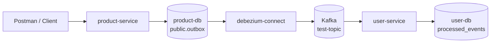

# Product Service Debezium Outbox Notlari

Bu dokuman `product-service` icindeki test outbox akisinin polling yerine Debezium CDC ile Kafka'ya tasinmasini aciklar.

Kapsam sadece `product-service` icindeki `public.outbox` tablosundan `test-topic` uzerine yayinlanan `TestEvent` akisidir. `order-service` icindeki `outbox_messages` akisi halen kendi scheduled publisher mekanizmasini kullanir; o akis icin `docs/order-product-event-flow.md` dosyasina bakilmalidir.

## Neden Debezium?

Eski yaklasimda uygulama belirli araliklarla outbox tablosunu sorguluyordu:

```text
SELECT * FROM outbox WHERE status = 'PENDING' ...
```

Bu polling yontemi uygulamanin Kafka publish sorumlulugunu tasimasina neden olur. Debezium yaklasiminda `product-service` sadece ayni veritabani transaction'i icinde outbox kaydi olusturur. PostgreSQL WAL kaydini Debezium okur ve Kafka'ya event'i kendisi gonderir.

Bu nedenle `product-service` icinde eski `OutboxPoller` ve `OutboxStatus` yapisi kaldirildi.

## Yuksek Seviye Akis



## Ilgili Dosyalar

- `microservices/product-service/src/main/java/com/turkcell/product_service/controller/ProductsController.java`
- `microservices/product-service/src/main/java/com/turkcell/product_service/entity/OutboxEvent.java`
- `microservices/product-service/src/main/java/com/turkcell/product_service/repository/OutboxRepository.java`
- `microservices/user-service/src/main/java/com/turkcell/user_service/consumer/TestEventConsumer.java`
- `microservices/user-service/src/main/java/com/turkcell/user_service/entity/ProcessedEvent.java`
- `docker/docker-compose.yml`
- `docker/debezium/product-outbox-connector.json`

## Product Outbox Tablosu

Debezium connector su tabloyu izler:

```text
public.outbox
```

Beklenen kolonlar:

```text
id UUID PRIMARY KEY
aggregate_type VARCHAR(255)
aggregate_id VARCHAR(255)
event_type VARCHAR(255)
topic VARCHAR(255)
payload TEXT
created_at TIMESTAMPTZ
```

`product-service` icinde `OutboxEvent` entity'si bu tabloya karsilik gelir. Kayit olusturulurken:

- `id`: event id
- `aggregate_type`: `Product`
- `aggregate_id`: product id
- `event_type`: `TestEvent`
- `topic`: `test-topic`
- `payload`: `TestEvent` JSON payload
- `created_at`: outbox kaydinin olusma zamani

`ProductsController.queueTestEvent(...)` artik Kafka'ya dogrudan publish etmez. Sadece outbox kaydi olusturur:

```text
Outbox kaydi olusturuldu. Topic: test-topic, Event ID: ...
```

Bu log sadece veritabanina outbox kaydi yazildigini gosterir. Kafka'ya gonderim Debezium tarafinda olur.

## Debezium Connector

Connector dosyasi:

```text
docker/debezium/product-outbox-connector.json
```

Onemli ayarlar:

```json
{
  "connector.class": "io.debezium.connector.postgresql.PostgresConnector",
  "database.hostname": "product-db",
  "database.dbname": "products",
  "table.include.list": "public.outbox",
  "snapshot.mode": "no_data",
  "transforms": "outbox",
  "transforms.outbox.type": "io.debezium.transforms.outbox.EventRouter",
  "transforms.outbox.route.by.field": "topic",
  "transforms.outbox.route.topic.replacement": "${routedByValue}",
  "transforms.outbox.table.field.event.id": "id",
  "transforms.outbox.table.field.event.key": "aggregate_id",
  "transforms.outbox.table.field.event.payload": "payload",
  "transforms.outbox.table.expand.json.payload": "true"
}
```

Bu ayarlarin anlami:

- Debezium sadece `public.outbox` tablosunu izler.
- `topic` kolonundaki deger Kafka topic adidir.
- Bu akis icin topic `test-topic` olur.
- `payload` kolonundaki JSON Kafka mesajinin body kismina tasinir.
- `table.expand.json.payload=true` nedeniyle payload string olarak degil, JSON obje olarak yayinlanir.
- `aggregate_id` Kafka message key olarak kullanilir.
- `event_type` ve `aggregate_type` header olarak eklenir.

`snapshot.mode=no_data` onemlidir. Connector ilk kez baslarken eski tablo satirlarini Kafka'ya basmaz; sadece connector calisir hale geldikten sonra gelen yeni insert'leri yayinlar.

## Docker Compose Bilesenleri

`docker/docker-compose.yml` icindeki ilgili servisler:

- `kafka`: Kafka broker
- `kafka-ui`: Kafka topic ve mesajlarini gormek icin UI, `http://localhost:8080`
- `product-db`: PostgreSQL product database
- `user-db`: PostgreSQL user database
- `product-db-schema`: `public.outbox` tablosunu connector baslamadan once olusturan tek seferlik job
- `debezium-connect`: Kafka Connect + Debezium runtime, `http://localhost:8083`
- `product-outbox-connector`: connector config'ini Debezium Connect'e kaydeden tek seferlik job
- `pgadmin`: `http://localhost:5050`

`product-db` logical replication icin su ayarlarla calisir:

```text
wal_level=logical
max_wal_senders=10
max_replication_slots=10
```

Bu ayarlar PostgreSQL WAL kayitlarini Debezium'un okuyabilmesi icin gereklidir.

## `product-outbox-connector registered` Ne Demek?

`product-outbox-connector` container'i surekli calisacak bir servis degildir. Sadece connector config'ini Debezium Connect'e kaydeder ve kapanir.

Bu nedenle su davranis normaldir:

```text
product-outbox-connector registered
container exited
```

Asil surekli calismasi gereken servis:

```text
debezium-connect
```

Connector durumunu kontrol etmek icin:

```bash
curl -s http://localhost:8083/connectors/product-outbox-connector/status
```

Beklenen durum:

```text
"state":"RUNNING"
```

Hem `connector` hem de `tasks` altinda `RUNNING` gorulmelidir.

## Manuel Test

Altyapiyi ac:

```bash
cd /Users/tamerakdeniz/Personal/microservices-spring
docker compose -f docker/docker-compose.yml up -d
```

Connector durumunu kontrol et:

```bash
curl -s http://localhost:8083/connectors/product-outbox-connector/status
```

Servisleri normal sekilde ayaga kaldir:

```bash
cd /Users/tamerakdeniz/Personal/microservices-spring/microservices
mvn -pl eureka-server spring-boot:run
mvn -pl gateway-server spring-boot:run
mvn -pl user-service spring-boot:run
mvn -pl product-service spring-boot:run
```

Postman istegi:

```http
POST http://localhost:8084/api/products?message=postman-debezium-test
```

Body gerekmez.

Beklenen response:

```text
Basarili
```

`product-service` logunda:

```text
Outbox kaydi olusturuldu. Topic: test-topic, Event ID: ...
```

`user-service` logunda:

```text
TestEvent ISLENDI: postman-debezium-test, Product ID: ..., Event ID: ...
```

## Neden Bazen Senkron Gibi Gorunuyor?

Akis senkron degildir. `product-service` Kafka'ya dogrudan mesaj gondermez; sadece outbox tablosuna insert yapar.

Debezium WAL kaydini cok hizli okuyabildigi icin Postman response'undan hemen sonra `user-service` consumer logu dusebilir. Bu durum akisin senkron oldugu anlamina gelmez.

Gercek akis:

```text
HTTP request -> DB insert -> WAL -> Debezium -> Kafka -> user-service
```

## Sik Gorulen Loglar

### Eureka `Connection refused`

Ornek:

```text
Connect to http://localhost:8761 failed: Connection refused
DiscoveryClient_PRODUCT-SERVICE ... was unable to send heartbeat
```

Bu Debezium veya Kafka hatasi degildir. `eureka-server` calismadiginda servisler register/heartbeat denemelerinde bu loglari uretir.

Cozum:

```bash
mvn -pl eureka-server spring-boot:run
```

Eureka hazir olmadan diger servisler basladiysa bir sure sonra kendileri tekrar register etmeyi deneyebilir. Temiz baslangic icin once Eureka, sonra gateway, sonra diger servisler acilabilir.

### Kafka `Not updating high watermark`

Ornek:

```text
Not updating high watermark for partition test-topic-0 as it is no longer assigned
```

Bu Kafka consumer group rebalance uyarisi. Genellikle su durumlarda gorulur:

- servis yeni baslarken veya kapanirken
- Spring Boot DevTools restart/reload yaptiginda
- ayni `groupId` ile consumer group yeniden dagitildiginda
- Kafka partition assignment degistiginde

Tekrar etse bile tek basina veri kaybi anlamina gelmez. Kontrol icin:

```bash
docker exec kafka /opt/kafka/bin/kafka-consumer-groups.sh \
  --bootstrap-server localhost:9092 \
  --describe \
  --group user-service-group
```

`LAG` degeri `0` ise consumer mesajlari yakalamis demektir.

Benzer kontrol:

```bash
docker exec kafka /opt/kafka/bin/kafka-consumer-groups.sh \
  --bootstrap-server localhost:9092 \
  --describe \
  --group product-service-group
```

### `No table filters found for filtered publication`

Debezium task ilk denemede su tip hata verebilir:

```text
No table filters found for filtered publication product_outbox_publication
```

Sebep: Connector kaydoldugu anda `public.outbox` tablosu henuz yoktur.

Bu nedenle compose'a `product-db-schema` job'i eklendi. Bu job connector'dan once outbox tablosunu olusturur.

Task failed durumdaysa:

```bash
curl -s -X POST \
  "http://localhost:8083/connectors/product-outbox-connector/restart?includeTasks=true&onlyFailed=true"
```

Sonra tekrar status kontrol edilir:

```bash
curl -s http://localhost:8083/connectors/product-outbox-connector/status
```

## Idempotency

`user-service` tarafinda `ProcessedEvent` tablosu kullanilir. `TestEventConsumer` once `eventId` daha once islenmis mi diye bakar.

Davranis:

- event ilk kez geldiyse islenir ve `processed_events` tablosuna kaydedilir
- ayni event tekrar gelirse ikinci kez islenmez

Log:

```text
Bu event zaten islendi: ...
```

Bu, Kafka'nin en az bir kez teslimat davranisina karsi consumer tarafinda koruma saglar.

## Faydali Komutlar

Altyapi durumu:

```bash
docker compose -f docker/docker-compose.yml ps
```

Debezium loglari:

```bash
docker logs -f debezium-connect
```

Kafka UI:

```text
http://localhost:8080
```

Debezium connector status:

```bash
curl -s http://localhost:8083/connectors/product-outbox-connector/status
```

Test event:

```bash
curl -X POST "http://localhost:8084/api/products?message=manual-test"
```

## Onemli Notlar

- `product-service` icin eski polling publisher kaldirildi; product test event akisi Debezium CDC ile ilerler.
- `order-service` outbox akisi halen scheduled publisher kullanir.
- `product-outbox-connector` container'inin kapanmasi normaldir.
- `debezium-connect` ayakta olmadan outbox insert'leri Kafka'ya gitmez.
- `snapshot.mode=no_data` nedeniyle connector baslamadan onceki eski outbox satirlari yayinlanmaz.
- Kafka topic route'u outbox tablosundaki `topic` kolonundan gelir.
- `test-topic` demo/test akisidir; gercek siparis stok akisi `order-created-topic` uzerindedir.
